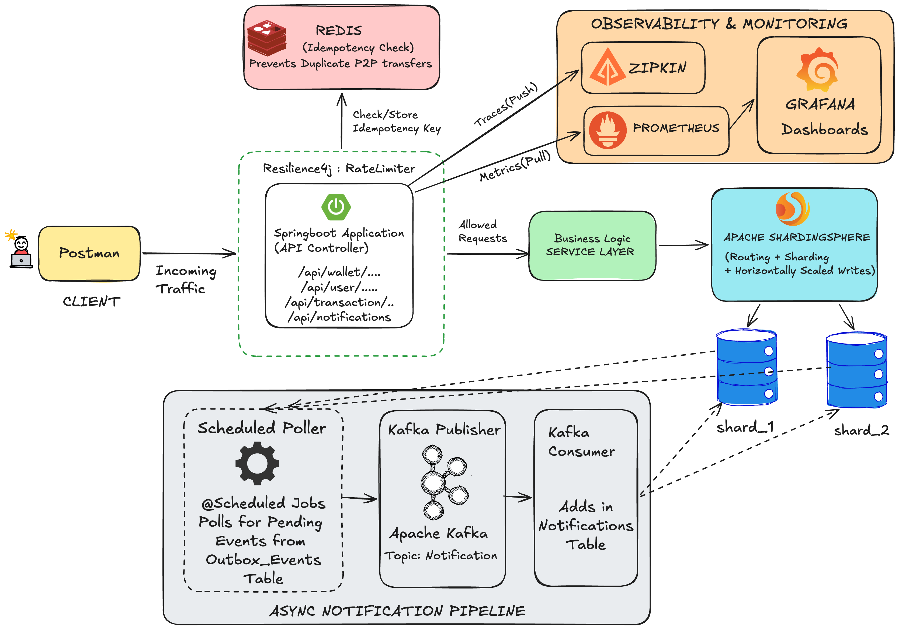
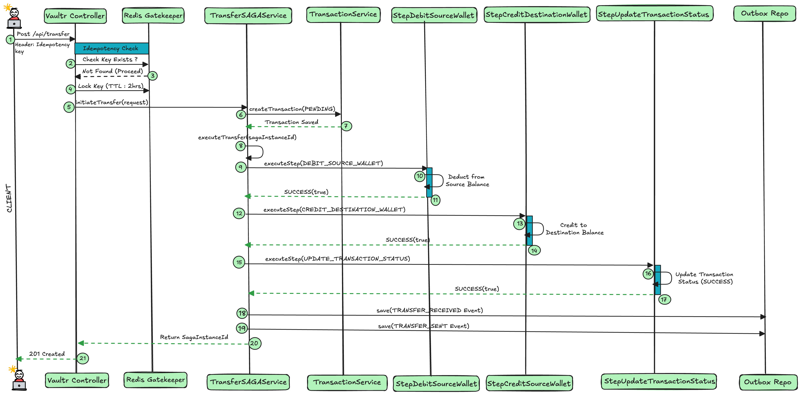
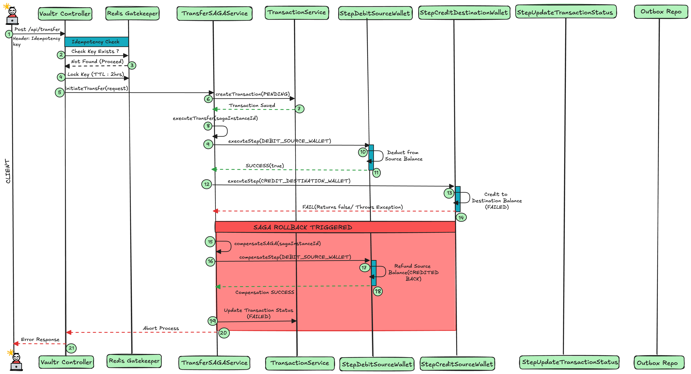
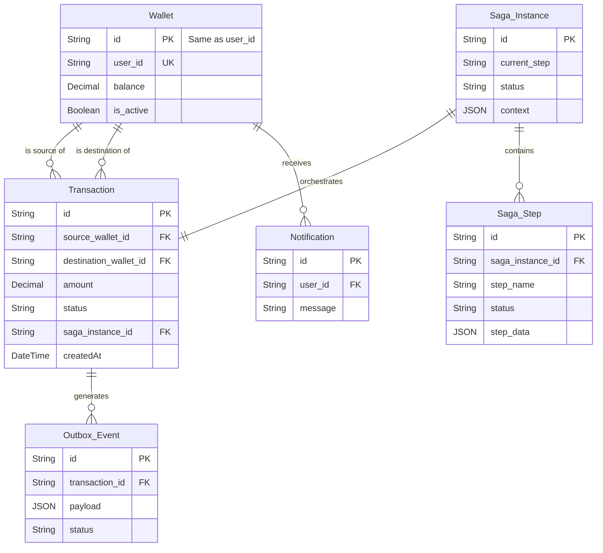
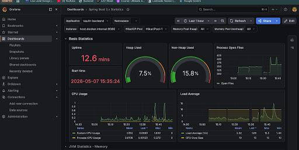
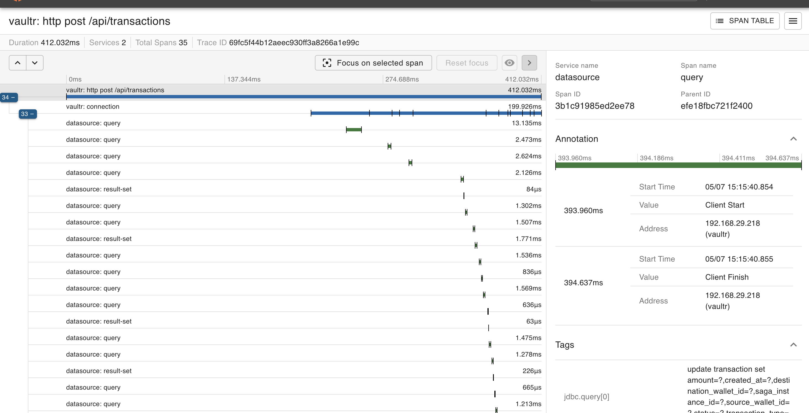

# Vaultr

A distributed P2P payment wallet engineered for correctness 
under failure — not just the happy path.

**250 TPS · sub-60ms p99 · 35+ trace spans per transaction**

## The Inspiration

At 12:00 PM, I received my monthly stipend slip.
At 6:00 PM, I received the "Account Credited" SMS.

That 6-hour gap made me ask — how do banks actually move
money without losing it?

**Vaultr** is my attempt to answer that.

This is what it took.
## The Problem

Moving money across distributed systems is easy.
Making sure it never gets lost, duplicated, or stuck — is not.

Vaultr is built around that guarantee.
## Stack

| Layer | Technology |
|---|---|
| Framework | Spring Boot 3.5.5 · Java 21 |
| Database | MySQL · Apache ShardingSphere 5.5.2 |
| Messaging | Apache Kafka (Aiven) |
| Caching | Redis (Upstash) |
| Observability | Zipkin · Prometheus · Grafana · Micrometer |
| Resilience | Resilience4j (Circuit Breaker · Retry · Rate Limiter) |
| Load Testing | k6 |
| Infrastructure | Docker Compose |

## Architecture

Vaultr is a monolithic Spring Boot application with a 
distributed systems core — designed to handle the failure 
modes that matter in financial infrastructure.

Three things were non-negotiable in the design:

1. **A payment must never be lost** — even if Kafka goes down
2. **A payment must never be duplicated** — even if the client retries
3. **A failed payment must always self-correct** — without manual intervention

Every architectural decision flows from these three constraints.
### System Overview
*How requests flow from client through Redis, ShardingSphere, 
Kafka, and into the notification pipeline.*

### Transfer — Happy Path
*All three SAGA steps succeed. Outbox events saved atomically. 
Kafka notifies both parties asynchronously.*

### Transfer — Failure Path  
*Credit step fails. SAGA triggers automatic compensation. 
Source wallet refunded. Transaction marked FAILED. No money lost.*

## Database Overview

Vaultr's schema is designed around the SAGA pattern — every 
entity exists to support either the transfer lifecycle, 
the compensation path, or the event pipeline.

A few deliberate decisions worth noting:

- **Wallet ID = User ID** — eliminates a join on every balance read
- **SAGA state is fully persistent** — every step transition is 
  recorded, making failures debuggable and compensations auditable
- **Outbox table is part of the core schema** — not an afterthought

## Design Decisions

### Why SAGA over 2PC?
2PC requires all participants to lock resources simultaneously. 
Under network failure, this creates indefinite blocking. 
SAGA executes steps sequentially — each reversible via a 
compensating transaction. No locks. No blocking. Safe rollback.

### Why Transactional Outbox over direct Kafka publish?
Publishing directly to Kafka after a DB commit creates a window 
where the commit succeeds but the publish fails — silently losing 
the event. The Outbox Pattern writes the event to the database 
in the same transaction as the transfer. A scheduled poller 
then publishes it. Kafka downtime cannot cause data loss.

### Why ShardingSphere over application-level sharding?
Application-level sharding leaks infrastructure concerns into 
business logic. ShardingSphere intercepts at the JDBC layer — 
routing queries transparently across shards. The application 
sees one logical database.

### Why Redis for Idempotency over a database check?
A database idempotency check adds a round trip on the critical 
payment path. Redis operates in-memory with sub-millisecond 
reads. Duplicate requests are rejected before any database 
interaction begins.

### Why Pessimistic Locking on Wallet reads?
Wallet balance updates are concurrent by nature — two transfers 
from the same wallet can race. Optimistic locking would require 
retry logic on collision. Pessimistic locking (`SELECT FOR UPDATE`) 
serializes access at the database level — eliminating the race 
condition entirely at the cost of throughput, which is acceptable 
for financial operations.

### Why a Scheduled Poller over Kafka Streams for Outbox relay?
Kafka Streams introduces consumer group coordination, offset 
management, and additional infrastructure complexity. A scheduled 
poller with `FOR UPDATE SKIP LOCKED` achieves the same guaranteed 
delivery guarantee with zero additional dependencies — multiple 
instances can run safely without duplicate processing.

### Why Orchestration SAGA over Choreography?
Choreography distributes control across services — each reacts 
to events independently. In a payment system, this makes 
failure tracing and compensation logic difficult to reason about. 
Orchestration centralizes control in a single `SagaOrchestrator` 
— every step, every compensation, every state transition is 
explicit and auditable.

### Why ULID over Auto-Increment or UUID for Sharded IDs?

Auto-increment requires a centralized sequence generator —
a single point of failure in a sharded architecture.

UUID is unique but random — poor index locality, causes
B-tree fragmentation at scale.

ULID is lexicographically sortable, globally unique, and
timestamp-prefixed — combining the distribution safety of
UUID with the index-friendliness of sequential IDs.
No coordination required across shards.

## Core Features

### Distributed SAGA Orchestration
Every P2P transfer executes as a three-step SAGA — debit source, 
credit destination, update transaction status. Each step is 
tracked independently in the database. On failure at any step, 
the orchestrator triggers compensating transactions in reverse 
order. No money is ever lost in an intermediate state.

### Transactional Outbox Pattern
Transfer completion events are written to an `outbox_event` 
table within the same database transaction as the transfer itself. 
A scheduled poller relays pending events to Kafka using 
`FOR UPDATE SKIP LOCKED` — allowing safe concurrent execution 
across multiple instances without duplicate publishing.

### Distributed Idempotency via Redis
Every transfer request carries an idempotency key. Redis checks 
and locks the key atomically before any processing begins. 
Duplicate requests within the TTL window are rejected instantly — 
before touching the database.

### Horizontal Database Sharding
Write traffic is distributed across two MySQL shards via Apache 
ShardingSphere. Routing is determined by a hash of the wallet ID 
at the JDBC layer — transparent to the application. Wallets are 
co-located with their users to eliminate cross-shard joins on 
the read path.

### Async Notification Pipeline
On transfer completion, both sender and receiver are notified 
via a decoupled Kafka consumer. Notification latency is completely 
removed from the transfer API response time.

### Resilience4j Circuit Breaker + Retry + RateLimiter
Database failures trigger automatic retry with exponential 
backoff. After threshold failures, the circuit breaker opens — 
returning a 503 immediately rather than holding threads while 
the downstream recovers.

### Distributed Tracing
Every request generates a trace across all SAGA steps via 
Micrometer and Zipkin — 35+ spans per transaction. Latency 
bottlenecks are visible at the step level, not just the 
request level.

## Performance

Load tested via k6 under sustained concurrent traffic.

| Metric | Result |
|---|---|
| Throughput | 250 SAGA transactions/sec |
| Avg Response Time | < 60ms |
| JVM Heap Utilization | < 10% |
| Zipkin Spans / Transaction | 35+ |
| Test Duration | 50 seconds |

Each transaction in this test represents a full SAGA execution — 
idempotency check, three database steps across two shards, 
outbox event write, and Kafka publish.

## Observability

> **Note:** The observability stack runs locally via Docker Compose 
> and is not included in the cloud deployment to avoid infrastructure 
> costs. All screenshots and metrics below are captured from local 
> load testing runs.

| Tool | Purpose |
|---|---|
| Zipkin | Distributed tracing across all SAGA steps |
| Prometheus | Metrics scraping via Spring Boot Actuator |
| Grafana | JVM heap, HikariCP pool, CPU, API latency |
| Micrometer | Instrumentation bridge to Prometheus |

### Grafana Dashboard

### Zipkin — 35+ spans per SAGA transaction

